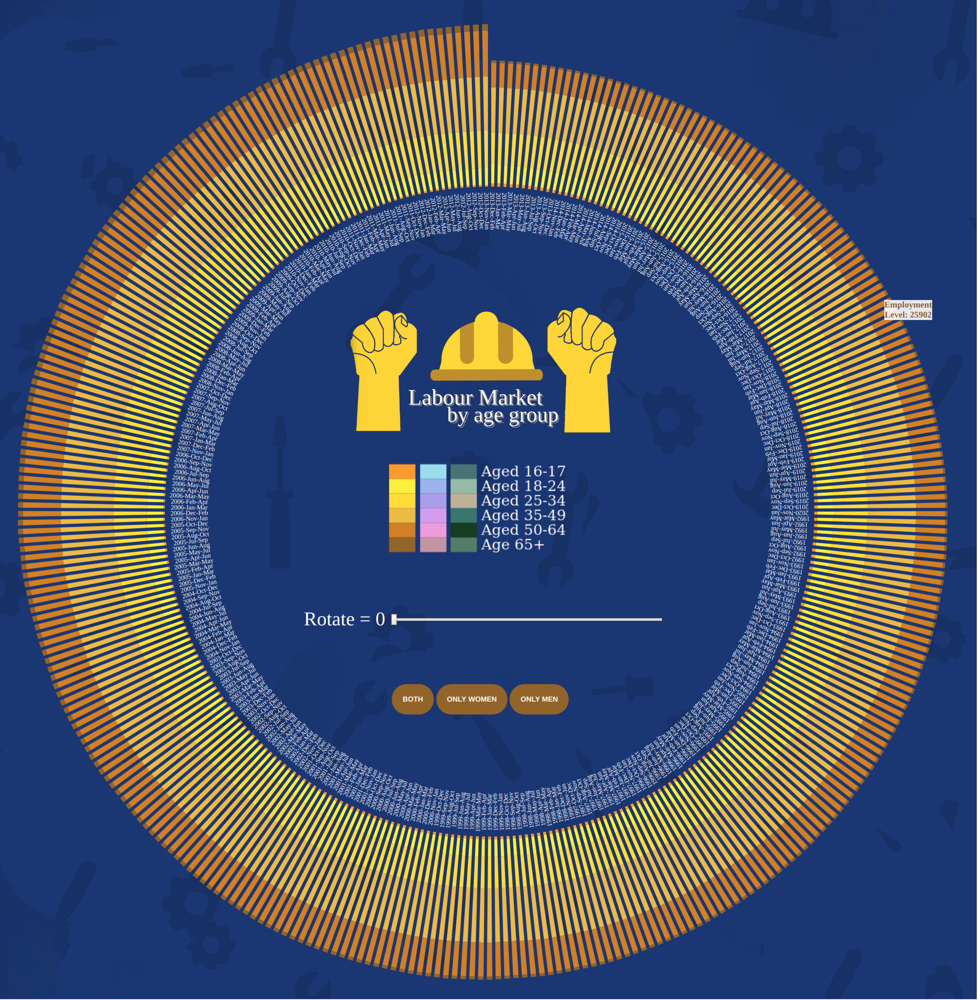
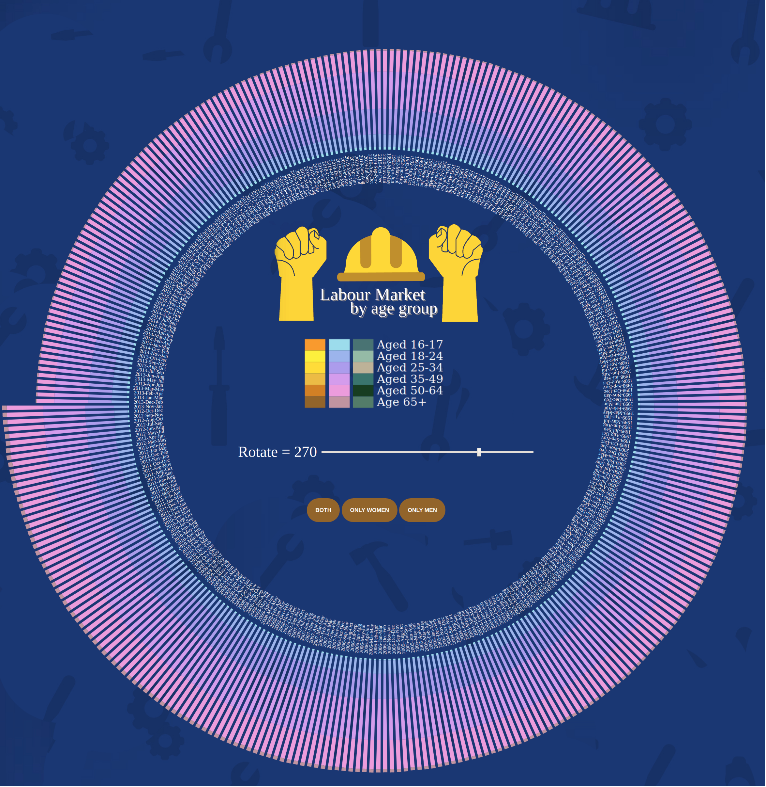
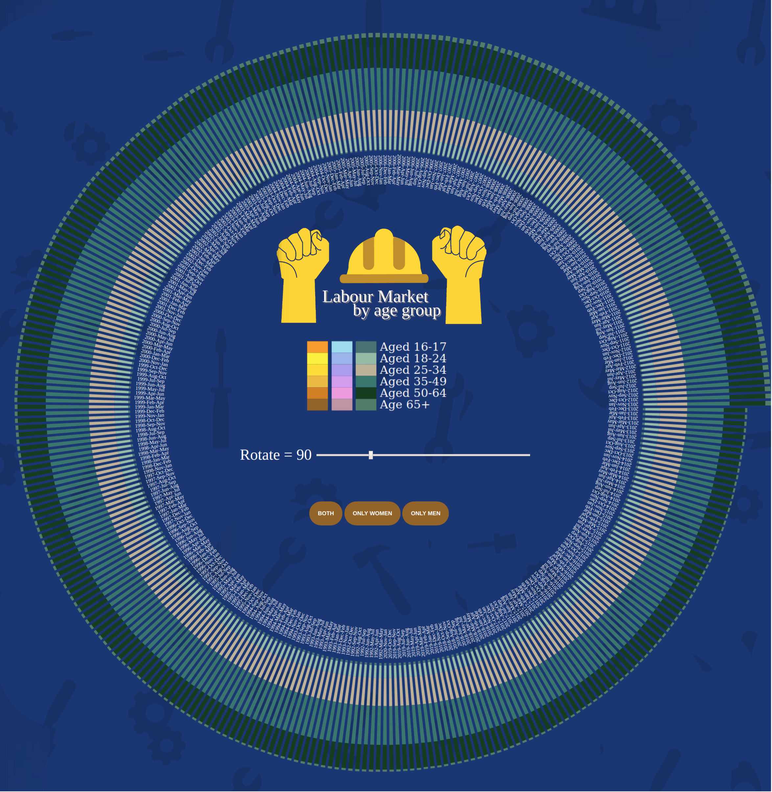

# radial stacked bar chart

## rotate, tooltip

### Opening terminal in the file root directory and input the following(python3):
```
python -m http.server
```
### clicking http://0.0.0.0:8000/ to open the server.
### click 
```
Index.html
```

## results

### both button:



### Women button:



### men button:



 Move the rotate button to rotate the entire visualization.
